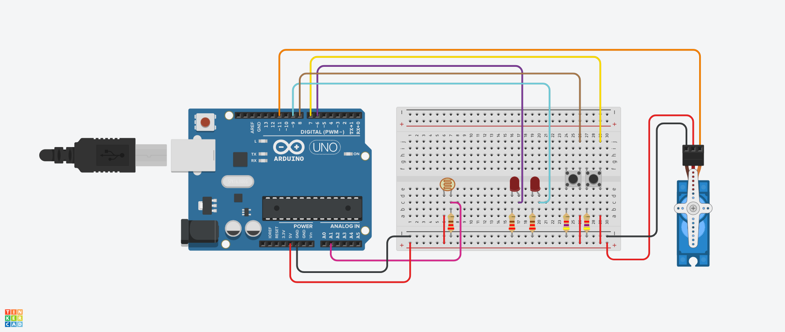

# 04.11
arduino practice

+ IlluminationSensor_CompareWithPrevious
  + 조도센서를 이용해 LED를 제어한다.
  + 현재 값이 크면 첫번째 LED를 이전의 값이 크면 두번째 LED를 켠다.
 
+ ServoRotation_With_Button
  + 버튼으로 서보모터를 제어한다.
  + 버튼을 누를 때마다 10도씩 서보모터가 움직이고 180도가 되면 다시 초기 상태로 돌아간다. 
